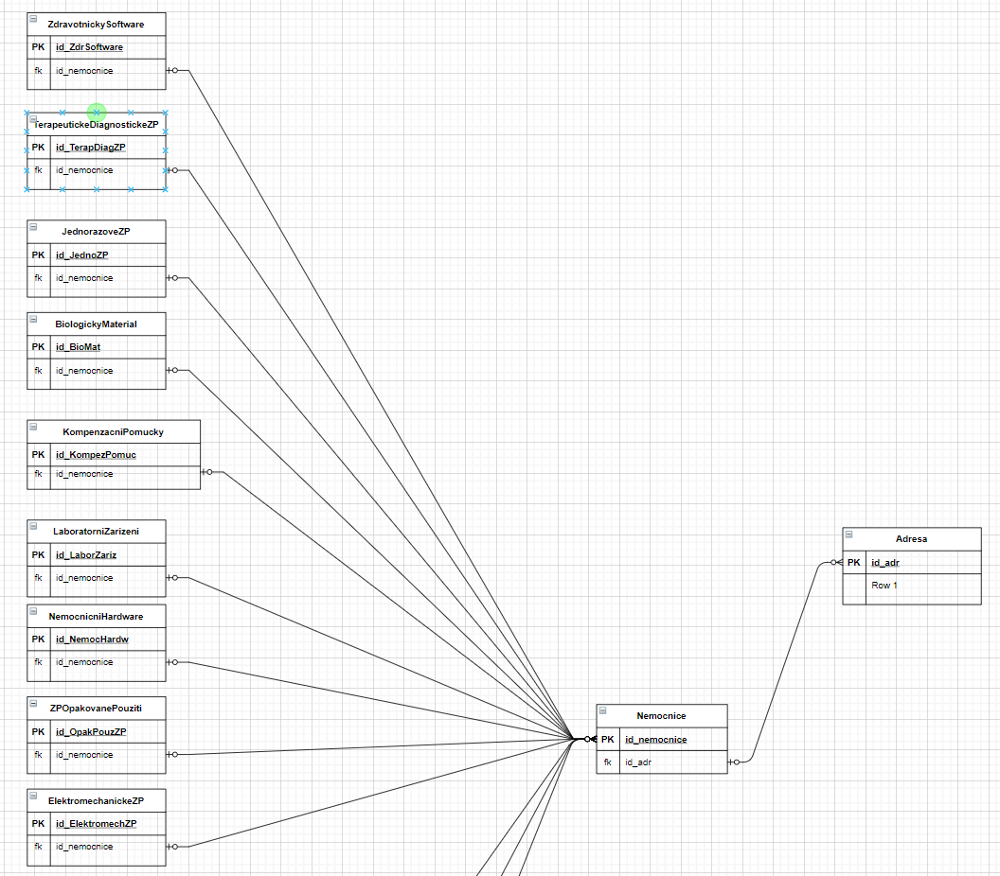
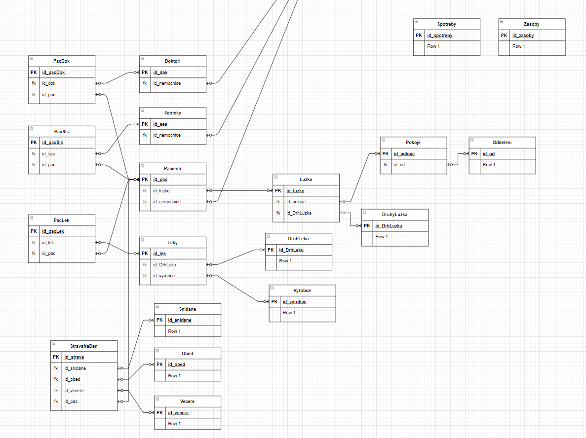

# Nemocnice_DB

## Zadání:

- Léky
- Lůžka
- Materiál
- Strava
- Zásoby
- Spotřeba

## Odevzdání:

-   ~~Slovní zadání cílového stavu navrhovaného MR~~
-   ~~Slovní popis funkcionality MR~~
-   ~~Excelovská tabulka atributů včetně:~~
    -   ~~Datových typů~~
    -   ~~Doménové integrity~~
    -   ~~Konkrétního příkladu ukládaných dat~~
-   ~~Konceptuální schéma navrhovaného MR~~
-   ~~Popř. realizaci v reálném db systému~~
-   ~~Dokumentace v PDF souboru~~

## Termíny:

- Kontrolnní dny: 18.10,25.10,1.11,8.11.2021
- Odevzdání: 8.11.2021, Disk O

## Diagram

